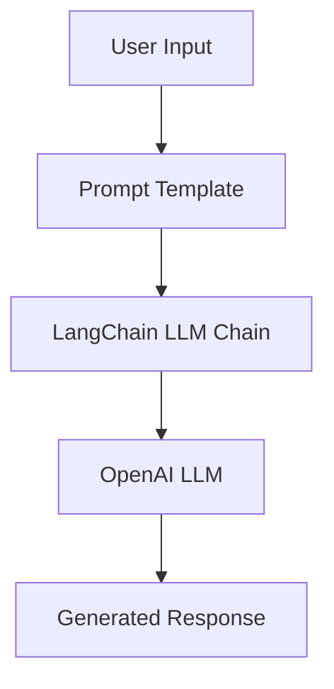

# LangChain RAG Tutorial

**Escuela Colombiana de Ingeniería Julio Garavito**  
**Student:** Santiago Botero García

## Overview

The purpose of this repository is to implement and document the **basic LangChain LLM Chain tutorial**, serving as a **foundational step** before building a full Retrieval-Augmented Generator (RAG) system.

## Repository Structure

```
├── README.md
├── langchain_rag_tutorial.ipynb
└── .gitignore
```

## Objective of This Repository

The main objectives are:

* To become familiar with **LangChain core concepts**
* To implement a **basic LLM Chain** using OpenAI
* To understand how prompts flow through chains
* To prepare the conceptual and technical foundation required for building RAGs

This work directly follows the official tutorial:

**LangChain LLM Chain Tutorial**
[https://python.langchain.com/docs/tutorials/llm_chain/](https://python.langchain.com/docs/tutorials/llm_chain/)

## Project Architecture and Components

### High-Level Architecture



### Main Components

| Component          | Description                                                       |
| ------------------ | ----------------------------------------------------------------- |
| **PromptTemplate** | Defines how user input is structured before being sent to the LLM |
| **LLM**            | Large Language Model used to generate responses                   |
| **LLMChain**       | LangChain abstraction that connects prompts with the LLM          |
| **Python Runtime** | Executes the chain and displays outputs                           |
