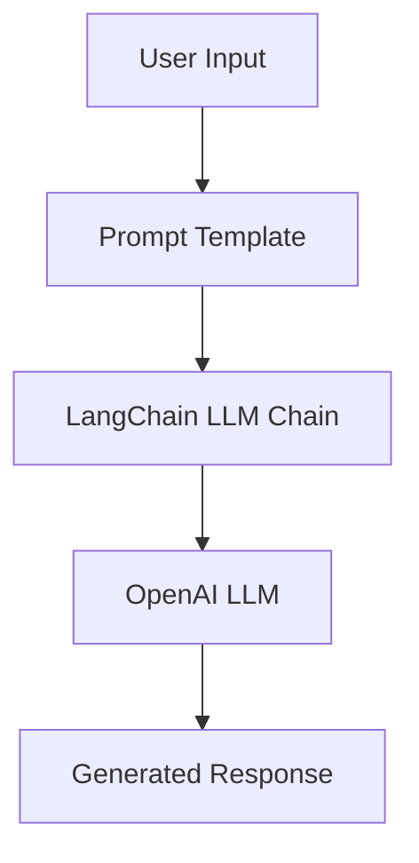

# LangChain RAG Tutorial

**Escuela Colombiana de Ingeniería Julio Garavito**  
**Student:** Santiago Botero García

## Overview

This repository documents the implementation of the **LangChain LLM Chain tutorial** as a foundational step toward building a complete **Retrieval-Augmented Generation (RAG)** system.

The project explores how prompts interact with Large Language Models (LLMs) using LangChain’s architecture, while also preparing the transition from simple LLM chains to full RAG pipelines.

This implementation supports both:

- **OpenAI models**
- **Google Gemini models**

## Repository Structure

```
├── README.md
├── langchain_rag_tutorial.ipynb
└── .gitignore
```

- `langchain_rag_tutorial.ipynb` &rarr; Main notebook implementation
- `README.md` &rarr; Project documentation
- `.gitignore` &rarr; Environment and dependency exclusions

## Objective of This Repository

The main objectives are:

- To understand **LangChain core abstractions**
- To implement a basic **LLM chain**
- To analyze how prompts flow through a model pipeline
- To compare OpenAI and Gemini integrations
- To prepare the technical foundation required for building a full **RAG system**

This work follows the official LangChain tutorial:

**LangChain LLM Chain Tutorial**
[https://python.langchain.com/docs/tutorials/llm_chain/](https://python.langchain.com/docs/tutorials/llm_chain/)

## Project Architecture and Components

### High-Level Architecture



### Main Components

| Component          | Description                                                       |
| ------------------ | ----------------------------------------------------------------- |
| **PromptTemplate** | Defines how user input is structured before being sent to the LLM |
| **LLM**            | Large Language Model used to generate responses                   |
| **LLMChain**       | LangChain abstraction that connects prompts with the LLM          |
| **Python Runtime** | Executes the chain and displays outputs                           |

## LLM Providers Used

### OpenAI Integration

Uses models such as:

- OpenAI GPT models

Integrated via:

```python
from langchain_openai import ChatOpenAI
```

### Google Gemini Integration

Uses models such as:

- Google AI Studio Gemini models
- `gemini-2.5-flash`
- `gemini-2.5-pro`

Integrated via:

```python
from langchain_google_genai import ChatGoogleGenerativeAI
```

This allows the system to remain **provider-agnostic**, meaning the same chain logic works with different LLM backends.

## Evolution of LangChain Architecture

This project also reflects an important architectural change in LangChain:

### Old Approach (Deprecated)

```python
LLMChain
AgentExecutor
```

### Modern Approach (LangChain &ge 0.3)

LangChain is moving toward the **Runnable API**, where components are composed using the pipe operator:

```python
chain = prompt | llm
```

This new pattern is:

- Simpler
- More modular
- More future-proof
- More aligned with RAG systems

### Full RAG Flow

RAG introduces:

- Document chunking
- Embeddings
- Vector databases
- Retrieval mechanisms

## Key Concepts Learned

Through this implementation, the following concepts were explored:

- Prompt engineering fundamentals
- Model abstraction layers
- Provider configuration (API keys, quotas, rate limits)
- Token usage and quota limitations
- Differences between model tiers (Flash vs Pro)
- Migration from Chains to Runnables

## Challenges Encountered

During development, several technical challenges were addressed:

- Python 3.13 compatibility issues
- LangChain package modularization (`langchain_classic`)
- Agent deprecations
- Gemini API quota limitations (HTTP 429 errors)
- Model access vs quota availability

These challenges helped deepen understanding of real-world LLM system constraints.

## Conclusion

This repository establishes the foundational knowledge required to build:

- Retrieval-Augmented Generation systems
- Multi-provider LLM applications
- Production-ready AI pipelines

It demonstrates not only how to implement a basic LLM chain, but also how to:

- Debug API quota errors
- Manage model selection
- Adapt to rapidly evolving AI frameworks
- Design provider-agnostic architectures

This project serves as the conceptual and technical groundwork for developing a full RAG system.
